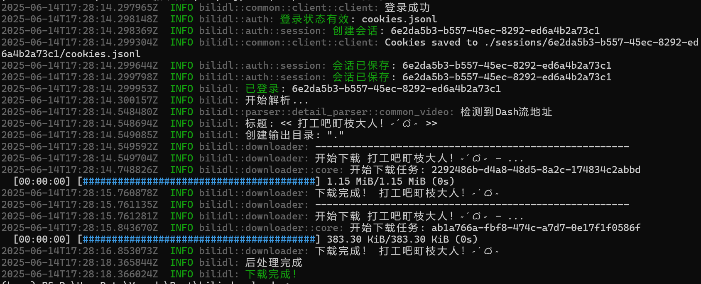

# BiliDownloader


🚀 一个使用Rust编写的bilibili命令行下载器。极致小巧（<10MB),  开箱即食。
> 来都来了，不给个star鼓励一下嘛？Thanks♪(･ω･)ﾉ



## ✨ 特性（画饼成分居多）

- 🔒 **多种登录方式**
  - [x] 二维码扫码登录（自动显示登录二维码）
  - [x] Cookie 文本登录（支持手动输入Cookie）
  - [x] 本地状态保存（自动记住登录信息）
- 🚄 **高效下载引擎**
  - [x] 自动音视频合并（DASH格式）
  - [x] 实时进度显示（清晰的下载状态）
  - [ ] 多线程并发下载（提升下载速度）
  - [ ] 断点续传支持（防止下载中断）
- 🎯 **智能视频解析**
  - [ ] 支持多种类型
    - [x] 单个普通视频
    - [x] 单集番剧
    - [ ] 整季番剧
    - [ ] 课程
    - [ ] 弹幕
    - [ ] 直播
  - [x] 支持 DASH 和 MP4 格式
  - [ ] 支持多种清晰度（从 360P 到 4K）
  - [ ] 智能选择最佳下载线路
- 🛠 **人性化设计**
  - 简洁的命令行界面
  - 详细的日志输出
  - 灵活的配置选项
  - 友好的错误提示

## 📝 命令行参数

```bash
用法: BiliDL [选项]

选项：
    --url <URL>             视频链接 (支持普通视频和番剧)
    --output <DIR>          视频保存目录 [默认: .]
    --quality <QUALITY>     视频质量: 116=4K, 80=1080P, 64=720P, 32=480P, 16=360P [默认: 80]
    --login                 登录B站账号 (需要下载高清视频时使用)
    --user-dir <DIR>        用户配置目录，用于保存登录状态
    --cookie <COOKIE>       手动指定Cookie (可选)
    --help                  显示帮助信息
    --version              显示版本信息
```

## 💡 使用示例

1. 简单下载视频：
```bash
bilidl --url "https://www.bilibili.com/video/BVxxxxxx"
```

2. 指定下载目录和质量：
```bash
bilidl --url "https://www.bilibili.com/video/BVxxxxxx" --output "D:/Videos" --quality 116
```

3. 使用登录下载高清视频：
```bash
# 首次使用需要登录
bilidl --login --user-dir "./config"

# 之后可以直接使用保存的登录状态
bilidl --url "https://www.bilibili.com/video/BVxxxxxx" --user-dir "./config" --quality 116
```

## 📥 快速开始

### 下载预编译版本

访问 [Releases](https://github.com/Rpeng666/bili_downloader/releases) 页面，下载适合您系统的最新版本：

- Windows: `BiliDL-Windows-x86_64.zip`
- Linux: `BiliDL-Linux-x86_64.tar.gz`
- macOS: `BiliDL-macOS-x86_64.tar.gz`

### 从源码安装

## 🔧 安装与编译

### 环境要求

- Rust 1.75 或更高版本
- FFmpeg（用于视频合并）
- 支持的操作系统：
  - Windows 10/11
  - macOS 10.15+
  - Linux（主流发行版）

### 安装 FFmpeg

Windows:
```powershell
winget install FFmpeg
```

macOS:
```bash
brew install ffmpeg
```

Linux:
```bash
# Ubuntu/Debian
sudo apt install ffmpeg

# CentOS/RHEL
sudo yum install ffmpeg
```

### 编译和安装

```bash
# 克隆仓库
git clone https://github.com/Rpeng666/bili_downloader
cd bili_downloader

# 编译
cargo build --release

## ⭐ 支持项目

如果这个项目对你有帮助，请给它一个 Star！
